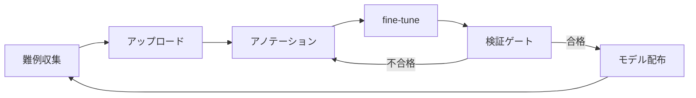
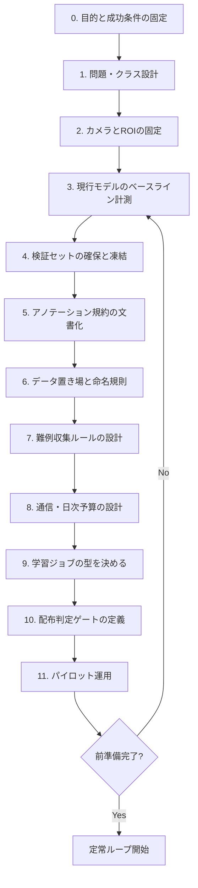

# Raspberry Pi エッジ運用と継続学習戦略

本ドキュメントは、エレベーター追跡システム（Raspberry Pi 4 / SORACOM Plan-D / YOLO）に関する設計討論の結果と、モデル改善のための学習方法・前準備フローをまとめたものです。

---

## 1. 前提・課題

| 項目 | 内容 |
|------|------|
| 実行環境 | Raspberry Pi 4 |
| 通信 | SORACOM Plan-D（データ上限 **500MB/月**） |
| 現状の通信 | MQTT で状態のみ送信（数バイト級・変化時）。通信量は余裕あり |
| 現状の推論 | Ultralytics YOLO（`.pt`）、カメラ映像から人物・階数・方向を検出 |
| 課題A | 系の安定動作、バッテリを一日できるだけ長く維持したい |
| 課題B | AIが弱く、重み・データが不足。継続的に強くしたい |
| 検討案 | C++ への置き換え、強化学習、画像のサーバー転送→日次学習→モデル配布 |

### 現行システムとの対応

- 推論本体: `ai.py`
- 学習・ONNX 書き出しの原型: `learningmodel.py`（`train` → `export(format="onnx")`）
- テレメトリ: `mqtt_pub.py`（バイナリ数バイト）

---

## 2. 討論の登場人物と立場

| 人物 | 立場 |
|------|------|
| A 組み込み屋 | 電池・熱・クラッシュ優先。C++ は部分的に有効 |
| B 機械学習屋 | 「弱い」の診断と学習戦略。古典的 RL には懐疑的 |
| C 通信屋 | Plan-D 500MB を絶対制約として設計する |
| D 現場運用屋 | 実証の現実。書き換えコストと壊れにくさ |
| E システム設計屋 | 全体アーキテクチャ。段階的移行 |

---

## 3. 討論結果サマリー

### 3.1 安定動作・バッテリと C++ 置き換え

**合意に近い結論**

- 電池・負荷の支配項は「言語」ではなく **推論頻度・解像度・モデルサイズ・カメラ常時処理**。
- Python → C++ 全面置換だけでは、同じ YOLO を同じ FPS で回す限り劇的には減らない。
- 先に効く対策: 推論 FPS 低下、解像度低下、軽量モデル（nano / INT8 / ONNX Runtime）、ヘッドレス化（GUI・pandas 削減）、間欠推論。
- C++ のメリット: 起動・メモリの予測可能性、systemd / ウォッチドッグとの相性、依存のスリム化。
- C++ のデメリット: 実装コスト、前処理・NMS の自前化、開発速度。
- 推奨ロードマップ: **Python のまま軽量化 → ONNX 化 → ホットパスのみ C++/ONNX Runtime**。全面置換は最終手段。

**C++ 化の効果感（目安）**

| 項目 | 効果 |
|------|------|
| 推論本体 | 中（ランタイム選定の方が効く） |
| Python / pandas オーバーヘッド | 小〜中 |
| カメラ I/O・制御ループの安定性 | 中 |
| 電池寿命 | FPS とモデルサイズの方が支配的 |

### 3.2 「AI が弱い」と強化学習

**合意に近い結論**

- 階数・矢印・人数は本質的に **教師あり物体検出 / 分類**。
- 古典的強化学習（行動→報酬）は本問題の第一選択ではない。
- 「重みが足りない」への処方箋:
  1. 難事例の追加アノテーション
  2. **能動学習**（迷ったフレームだけ収集）
  3. 慎重な擬似ラベル（半教師あり）
  4. データ拡張・クラス定義の見直し
- ユーザー案「エッジで推論 → 難例をクラウドへ → 学習 → モデルを戻す」は正しい方向だが、呼称は **継続学習 / 能動学習パイプライン** とするのが正確。
- 人物検出より **エレベーター表示（数字・up/down）** に学習予算を集中した方が ROI が高いことが多い。

### 3.3 500MB/月 vs 画像・モデル転送

**通信量の感覚値**

| 何を送るか | 概算 | Plan-D での可否 |
|------------|------|-----------------|
| MQTT（現状） | 数 KB〜数百 KB/日 | 余裕 |
| VGA JPEG 1枚 | 30〜80 KB | 選別必須 |
| 720p JPEG | 100〜300 KB | すぐ逼迫 |
| YOLO `.pt` / `.onnx` 1本 | 数 MB〜数十 MB | 月に数回が限界 |
| 生フレーム連続 | — | 不可 |

**打開策（合意）**

1. 全フレーム転送はしない。**難例のみ**（低〜中 conf、無検出継続、不自然な階ジャンプ等）。
2. **ROI 切り出し**（数字パネル）+ 低解像度 JPEG + 重複排除。
3. 日次アップロードに **MB 予算**を設ける（例: 学習用 5MB/日）。
4. モデル配布はセルラー前提にしない（小さい ONNX・低頻度、**メンテ時 Wi-Fi / 有線**が本命）。
5. 二段構成: メタデータ先行 → サーバーが必要な ID だけ画像再リクエスト、も有効。
6. MQTT は現状どおりテレメトリ専用を維持。

### 3.4 討論で割れた点

| 論点 | 分かれ方 |
|------|----------|
| C++ 全面 vs 部分 | 部分置換が多数派。全面は慎重派 |
| RL の是非 | 第一手段としては否定寄り。用語を教師あり継続学習に直す |
| SIM 完結 vs ハイブリッド通信 | ハイブリッド（上げはセルラー、モデル下げは別経路）推奨が強い |
| 画像を上げるか | 学習するなら間欠 ROI。通信量最優先なら上げず現地アノテ |

### 3.5 推奨アーキテクチャ（討論の統合案）

```
[Pi4]
 カメラ → (低FPS / 動き検知) → 軽量 ONNX 推論
      → 結果は MQTT（極小・変化時）
      → 難例 ROI だけキューに蓄積
      → 1日1回、予算内だけ HTTPS アップロード

[Server]
  難例をレビュー / アノテーション
  → 教師あり fine-tune
  → 検証ゲート通過後、小さい ONNX を生成
  → 原則非セルラー経路で配布（または極低頻度）
```

---

## 4. 学習方法（本採用方針）

### 4.1 採用するもの / しないもの

| 方式 | 方針 |
|------|------|
| 教師あり追加学習（fine-tune） | **本採用** |
| 能動学習（難例のみ収集） | **本採用**（通信制約と両立） |
| 擬似ラベル | 条件付き（高 conf のみ、検証悪化で破棄） |
| Pi 上での本格学習 | **非推奨**（熱・電池・品質） |
| 古典的強化学習 | **当面見送り** |

### 4.2 学習対象の優先度

1. **高**: エレベーター表示（数字・up/down）
2. **低**: 人物検出（汎用 `person` で足りることが多い）

### 4.3 定常学習ループ



#### Pi 側: 難例の定義例

- 確信度が低〜中（例: 0.25〜0.65）
- 一定時間、数字が出せない（見逃し）
- 階の不自然なジャンプ
- 人数の急変してすぐ戻る（ちらつき）
- 類似フレームは間引き（数秒に1枚など）

#### 送る内容

- フルフレームではなく **ROI JPEG**（例: 長辺 320、品質低め）
- メタデータ: 時刻、予測ラベル、conf、bbox、機体 ID など

#### サーバー側

1. YOLO 形式でアノテーション（既存 `datasets/` 構成に合わせる）
2. **検証セットは学習に混ぜない**
3. 現行最良重みから fine-tune（ゼロからの学習はしない）
4. 成果物: サーバー保管用 `.pt` + 配布用小さい `.onnx`
5. 検証で旧モデル比較 → 合格のみ配布候補

`learningmodel.py` の train → ONNX export は、サーバー側ジョブの原型として再利用できる。

### 4.4 データ量の目安

| 段階 | 追加の目安 | 期待 |
|------|------------|------|
| 応急 | 難例 100〜300 枚 | 特定失敗パターンが減る |
| 安定 | 累計 500〜1500 枚（多様） | 日次のブレが減る |
| 頭打ち | 量よりアノテ品質・規約統一 | — |

### 4.5 通信予算の例（学習用）

- 月 500MB のうち学習に月 200MB ≈ **約 6.5MB/日**
- ROI JPEG 40KB × 150 枚 ≈ 6MB → おおよそ **1日 100〜150 難例が上限感**
- モデル 15MB をセルラー配布するなら月数回が限界 → **メンテ時別経路が本命**

### 4.6 やってはいけないこと

- 全フレームをまとめてアップロードする
- ラベルなしで自動更新し続ける（誤りの自己強化）
- 検証セットなしでモデルを上書き配布する
- クラスを場当たりで増やす
- Raspberry Pi 上で本格的な強化学習・長時間学習を行う

---

## 5. 学習に必要な前準備フロー

定常ループに入る前に、以下を完了させる。



### 工程詳細

#### 0. 目的と成功条件の固定

- 改善対象（例: 階表示の見逃し、誤方向）
- 数値目標（例: 検証で数字 Recall +10%）
- 非目標（例: 今は人物モデルは触らない）

#### 1. 問題・クラス設計

- 学習対象の切り分け（表示優先など）
- クラス一覧の確定（`0`–`9`, `up`, `down` 等）
- クラス増殖の禁止ルール

#### 2. カメラと ROI の固定

- 設置条件を可能な範囲で固定
- パネル切り出し方法（固定座標 or 検出後クロップ）
- アップロード画像サイズの決定

#### 3. 現行モデルのベースライン計測

- 現行 `.pt` で現場または録画を評価
- 失敗分類（見逃し / 誤数字 / 誤方向 / ちらつき）
- 「弱い」を件数で記録

#### 4. 検証セットの確保と凍結

- 多様な条件で 50〜100 枚以上に正解付与
- **以後の学習データに混ぜない**

#### 5. アノテーション規約の文書化

- 枠の取り方（パネル全体か文字単位か）
- 見切・ボケ・反射の扱い
- 迷い時の優先ルール

#### 6. データ置き場と命名規則

- YOLO 形式（images / labels / `data.yaml`）
- train / val の分け方
- 日時・機体 ID など追跡可能な命名

#### 7. 難例収集ルールの設計

- キュー投入条件
- 重複排除
- 保存ペイロード（ROI + メタデータ）

#### 8. 通信・日次予算の設計

- 学習用の日次 MB 上限と枚数上限
- 上げ経路（HTTPS 等）と下げ経路（原則メンテ時非セルラー）

#### 9. 学習ジョブの型を決める

- ベース重みからの fine-tune
- 入力サイズ、エポック上限、早期終了
- 成果物: `.pt`（保管）+ `.onnx`（配布）

#### 10. 配布判定ゲートの定義

- 検証セットで旧モデルと比較
- 合格条件（全体改善、最悪クラスの致命的悪化なし）
- 不合格なら配布しない

#### 11. パイロット運用

- 難例収集を数日
- 手動アノテ → fine-tune 1 回 → 検証比較 → 1 台に手動載せ替え
- ROI・規約・通信量の詰まりを修正してから自動化

### 前準備の最短着手順

1. **0 → 1 → 4 → 5**（何を測り、何を正解とするか）
2. **2 → 7 → 8**（何を、どれだけ上げるか）
3. **6 → 9 → 10**（どう学習し、どう出すか）
4. **3 と 11**（現状把握と一回回す）

---

## 6. 最初の2週間の実践タスク（参考）

1. 失敗を3種に分類（見逃し / 誤数字 / 誤方向）
2. 難例キュー（ROI + メタ）の仕様を確定
3. 検証セットを先に固定
4. サーバーで fine-tune を1回実施し、検証で前後比較
5. 改善が出たら小さい ONNX を手動で1台に載せ、現場比較
6. 効果が見えてから、日次アップロードと学習ジョブを自動化

---

## 7. 関連ファイル

| ファイル | 役割 |
|----------|------|
| `ai.py` | エッジ推論・メインループ |
| `hard_example.py` | 難例判定 |
| `sample_queue.py` | ROI JPEG + メタのローカルキュー / 日次予算 |
| `upload_client.py` | アップロード骨組み（デフォルト無効） |
| `learningmodel.py` | 学習と ONNX export の原型 |
| `mqtt_pub.py` | 状態テレメトリ（学習用画像転送とは分離） |
| `config.py` | モデルパス・画像サイズ等の設定 |
| [server-active-learning-requirements.md](./server-active-learning-requirements.md) | サーバー機能要件（HTTPS 準備後に実装） |
| [edge-active-learning-usage.md](./edge-active-learning-usage.md) | エッジ MVP の使い方 |

---

## 8. 改訂履歴

| 日付 | 内容 |
|------|------|
| 2026-09-13 | 討論結果・学習方針・前準備フローを初版として整理 |
